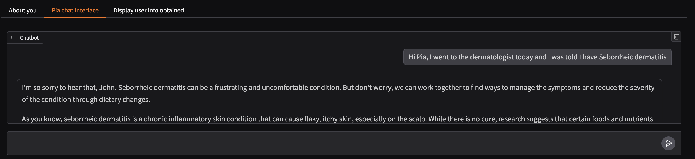
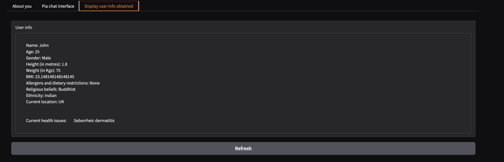
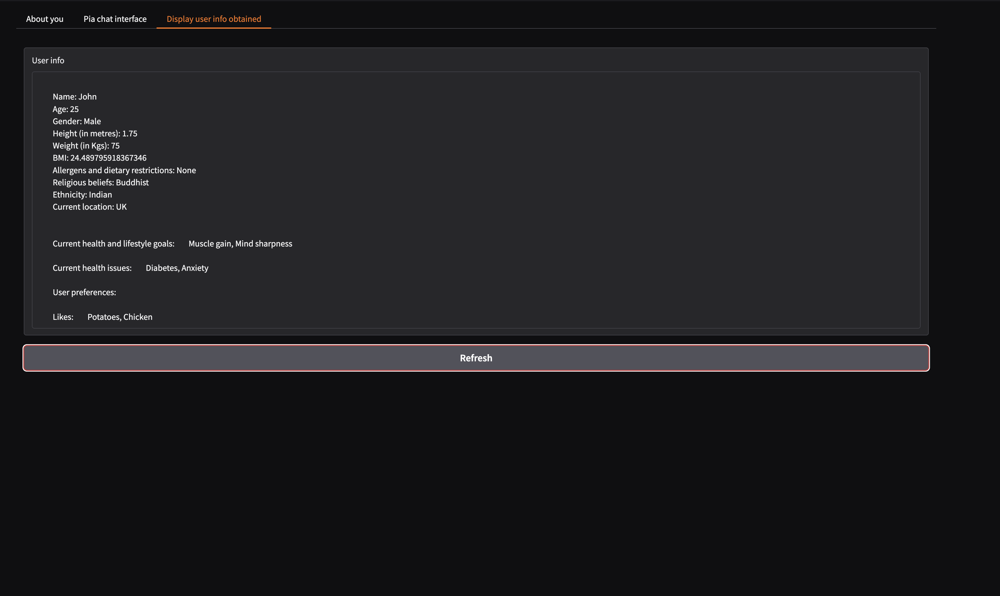

# Pia - Personalised nutrition coach that learns during conversation

## Overview 

Pia, a digital AI agent takes on the role of a nutrition coach. Based on the information it has obtained about the user, Pia adapts and 
responds to the users queries accordingly.

During the chat conversation, Pia converts the nstructured chat data to structured information that is relevant for nutrition coaching.

An example of how this works is illustrated as follows:


Figure 1: A conversation with Pia mentioning health issue

In the above image the user has a natural conversation with the chat agent mentioning their health issue - ’Seborrheic dermatitis’.

The response is generated to this chat message by the chat agent, while at the same time it also captures the health issue from the
message. As given in figure 2, the chat agent then identifies the health issue as ’Seborrheic dermatitis’, thus converting the unstructured chat data
to structured information about the user


Figure 2: User information captured from the conversation by Pia


Figure 3: Example where user health goals, health issues and preferences are obtained


## Tools used

1. Chatbot - Meta Llama 3.1 70B
2. Together AI for inferencing from Llama
3. Langchain
4. Gradio for UI

## Usage

1. Clone the repo:

```
git clone https://github.com/andymartin72/pia-personalised-nutrition-coach
cd pia-personalised-nutrition-coach
```

2. Configure API keys in a .env file:

You would need a Together.ai API key to run this chatbot (https://api.together.ai/)

```
TOGETHER_API_KEY = <your together API key>
```

3. Run the app

```
python pia_interface.py
```

The gradio UI link will be given as output. Copy and paste the link in your browser

4. Enter user info

In the 'About you' tab, enter user information. After entry is successful, start chatting with Pia!

